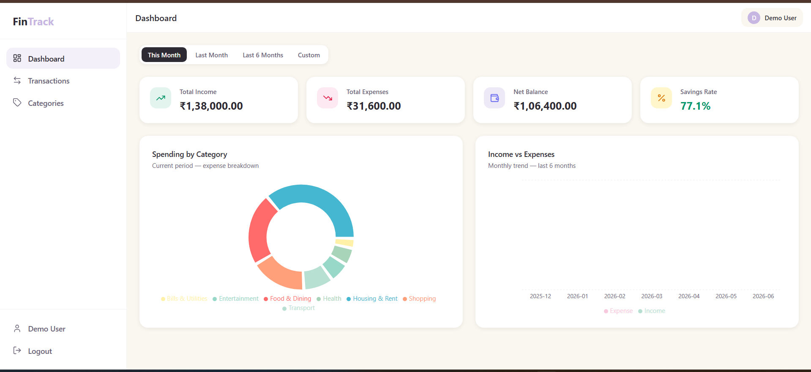
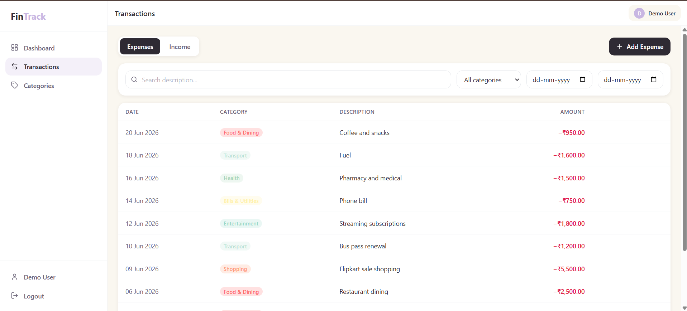
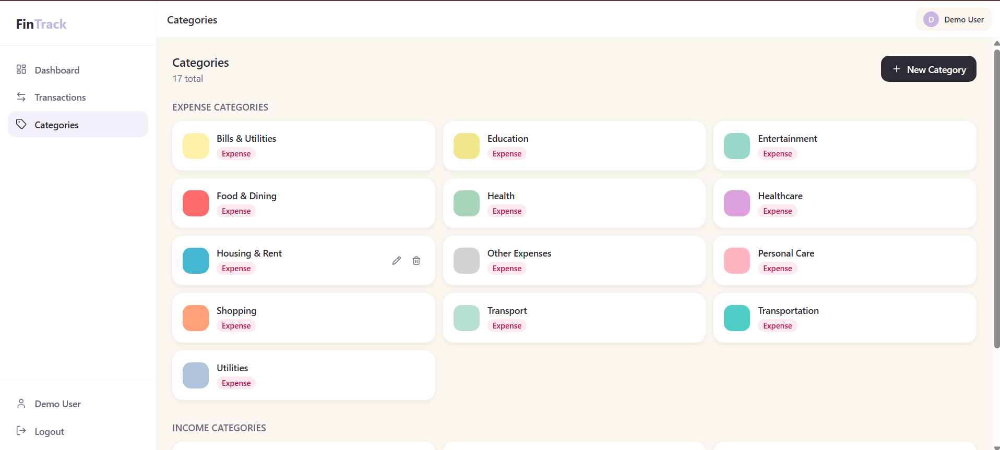
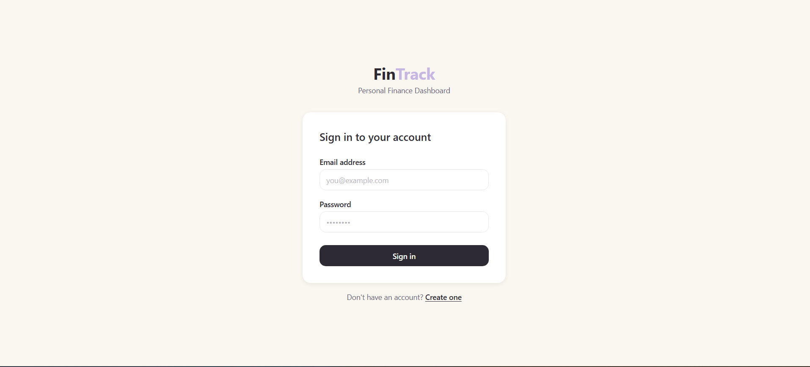

# FinTrack — Personal Finance Dashboard

A full-stack personal expense tracker built with Spring Boot and React. Track income, expenses, and visualize spending patterns through an interactive dashboard.

**Live Demo:** https://fintrack-fin.netlify.app

> Demo account — Email: `demo@fintrack.com` | Password: `demo1234`

---

## Screenshots

<!-- Add screenshots to a /screenshots folder and uncomment these -->

<!--  -->
<!--  -->
<!--  -->
<!--  -->

---

## Features

- JWT authentication with access token + refresh token
- Add, edit, and delete expenses and income
- Custom categories with colors and icons
- Dashboard with summary cards, donut chart, and monthly trend chart
- Filter and paginate transactions by date, category, and type
- Responsive sidebar layout
- Database schema managed automatically via Flyway migrations

---

## Tech Stack

### Backend
| Technology | Purpose |
|---|---|
| Java 21 + Spring Boot 3.3 | REST API framework |
| Spring Security + JWT (JJWT) | Authentication and authorization |
| Spring Data JPA + Hibernate | ORM and database access |
| PostgreSQL | Relational database |
| Flyway | Database schema migrations |
| MapStruct | Entity to DTO mapping |
| Lombok | Boilerplate reduction |
| SpringDoc / Swagger UI | API documentation |

### Frontend
| Technology | Purpose |
|---|---|
| React 19 + TypeScript | UI framework |
| Vite 8 | Build tool |
| Tailwind CSS v3 | Styling |
| React Router v6 | Client-side routing |
| Axios | HTTP client with JWT interceptor |
| React Hook Form + Zod | Form handling and validation |
| Recharts | Dashboard charts |
| React Hot Toast | Notifications |

### Infrastructure
| | |
|---|---|
| **Backend** | Render Web Service |
| **Frontend** | Netlify |
| **Database** | Render PostgreSQL (Singapore) |
| **Local dev** | Docker Compose |

---

## Project Structure

```
expenseTracker/
├── Backend/
│   ├── src/main/java/com/fintrack/
│   │   ├── user/          # Auth, registration, login, JWT
│   │   ├── category/      # Expense and income categories (CRUD)
│   │   ├── expense/       # Expense management (CRUD + filters)
│   │   ├── income/        # Income management (CRUD + filters)
│   │   ├── analytics/     # Summary, category breakdown, trends
│   │   ├── security/      # JWT filter, token service, refresh tokens
│   │   ├── config/        # Security config, CORS, OpenAPI
│   │   └── common/        # BaseEntity, error handling, pagination
│   ├── src/main/resources/
│   │   ├── application.yml        # Base config (env var driven)
│   │   ├── application-dev.yml    # Local development overrides
│   │   ├── application-prod.yml   # Production overrides
│   │   └── db/migration/
│   │       └── V1__init.sql       # Full schema (Flyway managed)
│   └── Dockerfile
│
├── Frontend/
│   ├── src/
│   │   ├── auth/              # Login, Register, AuthContext, ProtectedRoute
│   │   ├── features/
│   │   │   ├── dashboard/     # Summary cards, donut chart, trend chart
│   │   │   ├── transactions/  # Transaction table, filters, form
│   │   │   ├── categories/    # Category management
│   │   │   └── profile/       # User profile page
│   │   ├── components/
│   │   │   ├── ui/            # Button, Input, Card, Modal, Badge, etc.
│   │   │   └── layout/        # Sidebar, Topbar, DashboardLayout
│   │   ├── hooks/             # useExpenses, useIncomes, useCategories, etc.
│   │   ├── lib/               # Axios instance with interceptors
│   │   └── types/             # TypeScript interfaces
│   ├── netlify.toml           # SPA redirect rule for React Router
│   └── Dockerfile
│
└── docker-compose.yml         # Local dev: backend + frontend + postgres
```

---

## API Endpoints

Base URL: `https://expensetracker-jdzs.onrender.com/api/v1`

| Method | Endpoint | Description |
|---|---|---|
| POST | `/auth/register` | Create account |
| POST | `/auth/login` | Login, returns JWT |
| POST | `/auth/refresh` | Refresh access token |
| GET | `/users/me` | Current user profile |
| GET / POST | `/categories` | List or create categories |
| PUT / DELETE | `/categories/{id}` | Update or delete category |
| GET / POST | `/expenses` | List paginated or create expense |
| PUT / DELETE | `/expenses/{id}` | Update or delete expense |
| GET / POST | `/incomes` | List paginated or create income |
| PUT / DELETE | `/incomes/{id}` | Update or delete income |
| GET | `/analytics/summary` | Total income, expense, balance for a date range |
| GET | `/analytics/by-category` | Spending breakdown by category |
| GET | `/analytics/trends` | Month-by-month income vs expense |

Interactive docs: `https://expensetracker-jdzs.onrender.com/api/v1/swagger-ui.html`

---

## Running Locally with Docker

```bash
git clone https://github.com/PrachiBhari/expenseTracker.git
cd expenseTracker
docker compose up --build
```

- Frontend: http://localhost
- Backend API: http://localhost/api/v1
- Swagger UI: http://localhost/api/v1/swagger-ui.html

Database and schema are created automatically on first startup via Flyway.

---

## Running Without Docker

### Backend
```bash
cd Backend
mvn spring-boot:run
# Requires PostgreSQL running locally on port 5432
# API available at http://localhost:8080/api/v1
```

### Frontend
```bash
cd Frontend
cp .env.example .env
# Set VITE_API_BASE_URL=http://localhost:8080/api/v1 in .env
npm install
npm run dev
# App available at http://localhost:5173
```

---

## Environment Variables

### Backend (Render)
| Variable | Description |
|---|---|
| `SPRING_PROFILES_ACTIVE` | `prod` in production |
| `DB_URL` | JDBC PostgreSQL URL |
| `DB_USERNAME` | Database username |
| `DB_PASSWORD` | Database password |
| `JWT_SECRET` | HMAC-SHA384 signing key (64+ characters) |
| `CORS_ALLOWED_ORIGINS` | Frontend URL e.g. `https://fintrack-fin.netlify.app` |

### Frontend (Netlify)
| Variable | Description |
|---|---|
| `VITE_API_BASE_URL` | Backend API base URL |

---

## Key Design Decisions

**Stateless JWT auth** — No server-side sessions. Access tokens expire in 15 minutes. Refresh tokens are stored in the database and are revocable.

**Flyway migrations** — Schema is version-controlled SQL. No `ddl-auto: create` in any environment, which prevents accidental data loss on restart.

**CORS via environment variable** — `CORS_ALLOWED_ORIGINS` is injected at runtime so the allowed frontend URL can change without a code deploy.

**Axios interceptors** — JWT is attached to every outgoing request automatically. Any 401 response globally clears the token and redirects to login.

**React lazy loading** — Each page is code-split with `React.lazy()` and `Suspense`. Initial bundle reduced from 774KB to 383KB.

**flushSync on login** — `flushSync(() => login(...))` forces React to flush state updates synchronously before `navigate('/')` fires, preventing a race condition where `ProtectedRoute` would see stale `isAuthenticated=false` and redirect back to login.
