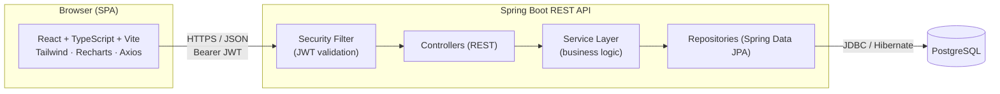
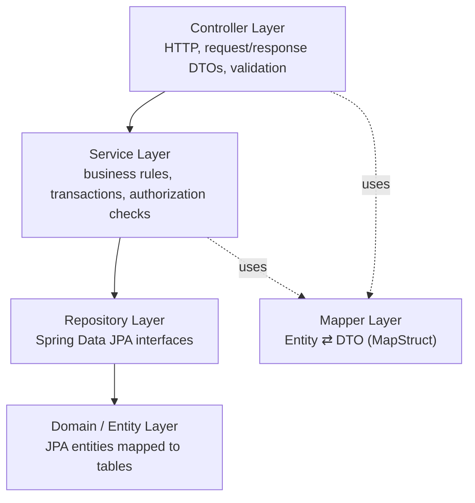
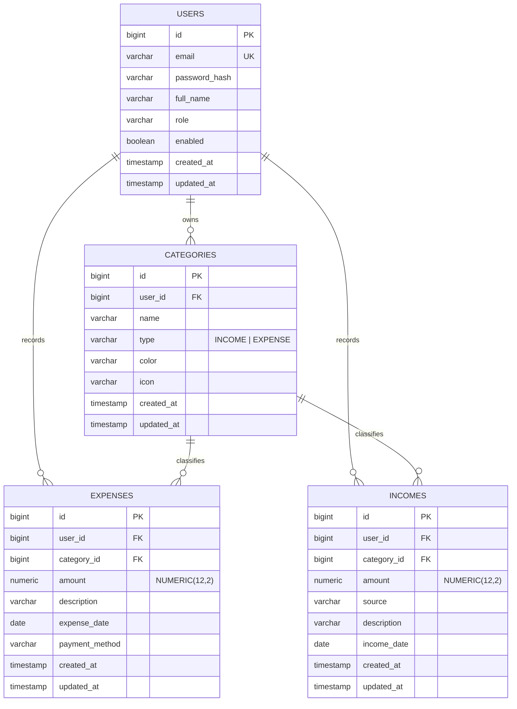
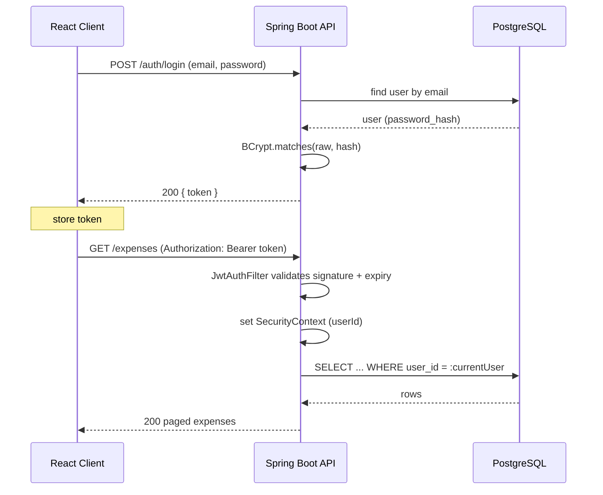
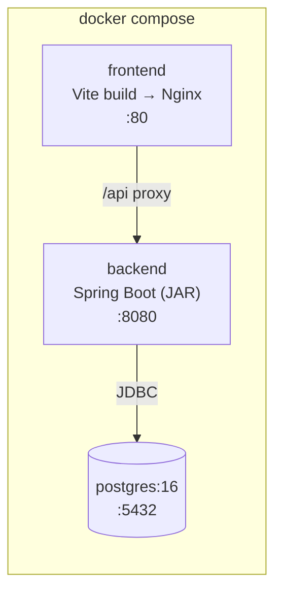

# Technical Requirements Document (TRD)
## Personal Expense Tracker & Finance Dashboard (FinTrack)

| Field | Value |
|-------|-------|
| **Document Type** | Technical Requirements Document |
| **Version** | 1.0 (MVP) |
| **Status** | Draft |
| **Owner** | *[Prachi Bhari & Rahul]* |
| **Last Updated** | June 2026 |
| **Related Docs** | `PRD.md` (Product Requirements Document) |

---

## 1. Purpose & Scope

This document translates the product requirements (`PRD.md`) into a concrete technical design: technology stack, system architecture, backend and frontend structure, database schema, API contracts, security model, DevOps setup, testing strategy, and a phased implementation plan.

The guiding principle is a **well-structured modular monolith** — clean layered architecture inside a single deployable backend service — which is the right level of complexity for the product's scale and for clearly demonstrating engineering fundamentals.

---

## 2. Technology Stack

### 2.1 Backend
| Concern | Choice |
|---------|--------|
| Language | Java 21 |
| Framework | Spring Boot 3.x |
| Security | Spring Security 6 + JWT (`jjwt` or `spring-security-oauth2-resource-server`) |
| Persistence | Spring Data JPA + Hibernate |
| Database | PostgreSQL 16 |
| Migrations | Flyway (recommended) |
| Build | Maven |
| Boilerplate reduction | Lombok |
| Validation | Jakarta Bean Validation (`spring-boot-starter-validation`) |
| Mapping | MapStruct (recommended) or manual mappers |
| API docs | springdoc-openapi (Swagger UI) |
| Testing | JUnit 5, Mockito, Spring Boot Test, Testcontainers (recommended) |

### 2.2 Frontend
| Concern | Choice |
|---------|--------|
| Library | React 18 |
| Language | TypeScript |
| Build tool | Vite |
| Styling | Tailwind CSS |
| Routing | React Router |
| HTTP | Axios |
| Forms | React Hook Form |
| Validation | Zod |
| Charts | Recharts |
| Server state (optional, recommended) | TanStack Query (React Query) |

### 2.3 DevOps & Tooling
Docker, Docker Compose, Swagger/OpenAPI, Git/GitHub, Postman, and a free deployment target (e.g., Render / Railway / Fly.io for backend + managed Postgres, and Vercel/Netlify for the frontend).

---

## 3. System Architecture

### 3.1 High-Level Architecture
A three-tier architecture: a React SPA talks to a Spring Boot REST API over HTTPS/JSON, and the API persists to PostgreSQL. Authentication is stateless via JWT.



### 3.2 Backend Layered Architecture
Strict, one-directional dependency flow. Each layer has a single responsibility, and data crosses the API boundary only as DTOs (never raw entities).



**Responsibilities**
- **Controller:** maps HTTP to method calls, validates request DTOs, returns response DTOs and status codes. No business logic.
- **Service:** all business logic, transaction boundaries (`@Transactional`), ownership/authorization checks, orchestration of repositories and mappers.
- **Repository:** data access via Spring Data JPA; custom queries via derived methods or `@Query`.
- **Entity:** JPA-mapped domain model; never serialized directly to clients.
- **DTO + Mapper:** decouple the API contract from the persistence model.

### 3.3 Cross-Cutting Concerns
- **Security:** a JWT authentication filter populates the `SecurityContext`; method/endpoint authorization enforced via Spring Security config.
- **Validation:** Bean Validation annotations on request DTOs, triggered by `@Valid`.
- **Error handling:** a global `@RestControllerAdvice` produces a consistent error envelope.
- **Logging:** SLF4J/Logback; never log secrets, passwords, or full tokens.
- **Config:** externalized via `application.yml` + environment variables (12-factor style).

---

## 4. Backend Module / Package Structure

A **feature-oriented (package-by-feature)** layout keeps related classes together and scales cleanly. Shared infrastructure lives under `common` and `config`.

```
com.fintrack
├── FinTrackApplication.java
├── config
│   ├── SecurityConfig.java
│   ├── OpenApiConfig.java
│   ├── CorsConfig.java
│   └── JpaAuditingConfig.java
├── common
│   ├── exception          # custom exceptions
│   │   ├── ResourceNotFoundException.java
│   │   ├── DuplicateResourceException.java
│   │   └── GlobalExceptionHandler.java   # @RestControllerAdvice
│   ├── dto                # shared DTOs (ApiError, PageResponse)
│   └── util
├── security
│   ├── JwtService.java            # create/parse/validate tokens
│   ├── JwtAuthFilter.java         # OncePerRequestFilter
│   ├── CustomUserDetailsService.java
│   └── AuthenticatedUser.java     # helper to get current user id
├── user
│   ├── User.java                  # @Entity
│   ├── UserRepository.java
│   ├── UserService.java
│   ├── AuthController.java        # /auth/register, /auth/login
│   ├── UserController.java        # /users/me
│   └── dto                        # RegisterRequest, LoginRequest, AuthResponse, UserResponse
├── category
│   ├── Category.java
│   ├── CategoryType.java          # enum INCOME/EXPENSE
│   ├── CategoryRepository.java
│   ├── CategoryService.java
│   ├── CategoryController.java
│   ├── CategoryMapper.java
│   └── dto
├── expense
│   ├── Expense.java
│   ├── ExpenseRepository.java
│   ├── ExpenseService.java
│   ├── ExpenseController.java
│   ├── ExpenseMapper.java
│   └── dto
├── income
│   ├── Income.java
│   ├── IncomeRepository.java
│   ├── IncomeService.java
│   ├── IncomeController.java
│   ├── IncomeMapper.java
│   └── dto
└── analytics
    ├── AnalyticsService.java
    ├── AnalyticsController.java
    └── dto                        # SummaryResponse, CategoryBreakdown, TrendPoint
```

---

## 5. Database Design

### 5.1 Design Decisions
- **PostgreSQL** as the single relational store.
- **Identifiers:** `BIGSERIAL` (auto-increment) is simplest and demo-friendly; UUIDs are noted as an alternative where non-guessable IDs matter. The MVP uses `BIGINT` PKs.
- **Money:** stored as `NUMERIC(12,2)` — **never** `float`/`double` (avoids rounding errors). This is a deliberate, defensible interview point.
- **Ownership:** every transactional row carries a `user_id` FK; all queries filter by it for data isolation.
- **Auditing:** `created_at` / `updated_at` via JPA auditing.
- **Expense vs. Income as separate tables:** matches the domain model in the PRD and keeps each entity's columns clean. *(Trade-off: a unified `transactions` table with a `type` column would reduce duplication and simplify analytics queries; it is a valid alternative and a good discussion point. The MVP keeps them separate for clarity.)*
- **Category deletion policy:** `ON DELETE` is **restricted** at the DB level; the service layer either blocks deletion of in-use categories or reassigns affected rows to a per-user "Uncategorized" category. (Recommended: block-if-in-use for MVP simplicity.)

### 5.2 Entity-Relationship Diagram



### 5.3 Table Definitions

**`users`**
| Column | Type | Constraints |
|--------|------|-------------|
| id | BIGSERIAL | PK |
| email | VARCHAR(255) | NOT NULL, UNIQUE |
| password_hash | VARCHAR(255) | NOT NULL |
| full_name | VARCHAR(120) | NULL |
| role | VARCHAR(20) | NOT NULL, default `'USER'` |
| enabled | BOOLEAN | NOT NULL, default `true` |
| created_at | TIMESTAMP | NOT NULL |
| updated_at | TIMESTAMP | NOT NULL |

**`categories`**
| Column | Type | Constraints |
|--------|------|-------------|
| id | BIGSERIAL | PK |
| user_id | BIGINT | NOT NULL, FK → users(id) |
| name | VARCHAR(80) | NOT NULL |
| type | VARCHAR(10) | NOT NULL, CHECK in ('INCOME','EXPENSE') |
| color | VARCHAR(20) | NULL |
| icon | VARCHAR(40) | NULL |
| created_at / updated_at | TIMESTAMP | NOT NULL |
| | | UNIQUE (user_id, name, type) |

**`expenses`**
| Column | Type | Constraints |
|--------|------|-------------|
| id | BIGSERIAL | PK |
| user_id | BIGINT | NOT NULL, FK → users(id) |
| category_id | BIGINT | NOT NULL, FK → categories(id) |
| amount | NUMERIC(12,2) | NOT NULL, CHECK (amount > 0) |
| description | VARCHAR(255) | NULL |
| expense_date | DATE | NOT NULL |
| payment_method | VARCHAR(40) | NULL |
| created_at / updated_at | TIMESTAMP | NOT NULL |

**`incomes`**
| Column | Type | Constraints |
|--------|------|-------------|
| id | BIGSERIAL | PK |
| user_id | BIGINT | NOT NULL, FK → users(id) |
| category_id | BIGINT | NULL, FK → categories(id) |
| amount | NUMERIC(12,2) | NOT NULL, CHECK (amount > 0) |
| source | VARCHAR(120) | NULL |
| description | VARCHAR(255) | NULL |
| income_date | DATE | NOT NULL |
| created_at / updated_at | TIMESTAMP | NOT NULL |

### 5.4 Indexing Strategy
- `users(email)` — unique index (login lookups).
- `expenses(user_id, expense_date)` — composite index for the most common query pattern (a user's transactions over a date range).
- `incomes(user_id, income_date)` — same rationale.
- `expenses(category_id)` and `incomes(category_id)` — for category breakdowns and FK joins.
- `categories(user_id)` — list a user's categories.

### 5.5 Migrations
Schema is versioned with **Flyway** (`V1__init.sql`, `V2__seed_default_categories.sql`, …). This makes the schema reproducible, reviewable, and demonstrates production-grade DB practice rather than relying on Hibernate `ddl-auto=update`.

---

## 6. API Design

### 6.1 Conventions
- Base path: `/api/v1`.
- JSON request/response bodies; `Content-Type: application/json`.
- Stateless auth: `Authorization: Bearer <jwt>` on all protected endpoints.
- Plural, noun-based resource paths; HTTP verbs convey intent.
- Standard status codes: `200` OK, `201` Created, `204` No Content, `400` validation, `401` unauthenticated, `403` forbidden, `404` not found, `409` conflict.
- List endpoints support pagination (`page`, `size`, `sort`) and return a paged envelope.

### 6.2 Standard Error Envelope
```json
{
  "timestamp": "2026-06-20T10:15:30Z",
  "status": 400,
  "error": "Validation Failed",
  "message": "amount must be greater than 0",
  "path": "/api/v1/expenses",
  "fieldErrors": [
    { "field": "amount", "message": "must be greater than 0" }
  ]
}
```

### 6.3 Endpoint Catalogue

**Auth & User**
| Method | Path | Auth | Description |
|--------|------|------|-------------|
| POST | `/auth/register` | Public | Create account; returns user + token (or 201). |
| POST | `/auth/login` | Public | Authenticate; returns JWT (+ optional refresh). |
| POST | `/auth/refresh` | Public* | Exchange refresh token for a new access token *(if refresh tokens are used)*. |
| GET | `/users/me` | Bearer | Current user's profile. |

**Categories**
| Method | Path | Auth | Description |
|--------|------|------|-------------|
| GET | `/categories?type=EXPENSE` | Bearer | List the user's categories (optionally by type). |
| POST | `/categories` | Bearer | Create a category. |
| GET | `/categories/{id}` | Bearer | Get one (ownership enforced). |
| PUT | `/categories/{id}` | Bearer | Update. |
| DELETE | `/categories/{id}` | Bearer | Delete (blocked if in use). |

**Expenses**
| Method | Path | Auth | Description |
|--------|------|------|-------------|
| GET | `/expenses` | Bearer | List with filters & pagination (see §6.5). |
| POST | `/expenses` | Bearer | Create an expense. |
| GET | `/expenses/{id}` | Bearer | Get one. |
| PUT | `/expenses/{id}` | Bearer | Update. |
| DELETE | `/expenses/{id}` | Bearer | Delete. |

**Incomes** — identical shape under `/incomes`.

**Analytics**
| Method | Path | Auth | Description |
|--------|------|------|-------------|
| GET | `/analytics/summary?from=&to=` | Bearer | Totals: income, expense, net balance. |
| GET | `/analytics/by-category?type=EXPENSE&from=&to=` | Bearer | Category breakdown for charts. |
| GET | `/analytics/trends?months=6` | Bearer | Monthly income vs. expense series. |

### 6.4 Example Contracts

**POST `/auth/register` — request**
```json
{ "fullName": "Aisha K", "email": "aisha@example.com", "password": "S3curePass!" }
```
**Response `201`**
```json
{
  "token": "eyJhbGciOiJIUzI1NiІ...",
  "tokenType": "Bearer",
  "user": { "id": 1, "fullName": "Aisha K", "email": "aisha@example.com" }
}
```

**POST `/expenses` — request**
```json
{
  "amount": 250.00,
  "categoryId": 4,
  "description": "Groceries",
  "expenseDate": "2026-06-18",
  "paymentMethod": "UPI"
}
```
**Response `201`**
```json
{
  "id": 88,
  "amount": 250.00,
  "category": { "id": 4, "name": "Food", "color": "#F8C8DC" },
  "description": "Groceries",
  "expenseDate": "2026-06-18",
  "paymentMethod": "UPI",
  "createdAt": "2026-06-18T09:12:00Z"
}
```

**GET `/analytics/summary` — response**
```json
{
  "from": "2026-06-01",
  "to": "2026-06-30",
  "totalIncome": 40000.00,
  "totalExpense": 18250.50,
  "netBalance": 21749.50
}
```

**GET `/analytics/by-category` — response**
```json
[
  { "categoryId": 4, "name": "Food",    "color": "#F8C8DC", "total": 6200.00 },
  { "categoryId": 7, "name": "Rent",    "color": "#C8B6E2", "total": 9000.00 },
  { "categoryId": 9, "name": "Travel",  "color": "#FFF1A8", "total": 3050.50 }
]
```

### 6.5 Filtering & Pagination (transactions)
`GET /expenses` query parameters:

| Param | Example | Meaning |
|-------|---------|---------|
| `from`, `to` | `2026-06-01`, `2026-06-30` | Date range (inclusive). |
| `categoryId` | `4` | Filter by category. |
| `minAmount`, `maxAmount` | `100`, `1000` | Amount range. |
| `q` | `groceries` | Text search on description. |
| `page`, `size` | `0`, `20` | Pagination. |
| `sort` | `expenseDate,desc` | Sort field & direction. |

Implemented server-side using Spring Data `Pageable` plus either JPA **Specifications** (recommended for combinable filters) or a tailored `@Query`.

---

## 7. Authentication & Authorization Design

### 7.1 Model
Stateless JWT. On login the server issues a signed access token containing the user id/email and an expiry; the client stores it and attaches it as a Bearer token. A `JwtAuthFilter` validates the token on each request and sets the `SecurityContext`. No server-side session store.

### 7.2 Login / Request Flow


### 7.3 Key Decisions & Best Practices
- **Password hashing:** BCrypt via Spring Security `PasswordEncoder`.
- **Authorization:** every service method scopes data by the authenticated user's id; a user can never read/mutate another user's rows (return `404` rather than `403` to avoid leaking existence, optional).
- **Token storage trade-off:** `localStorage` is simplest (XSS-exposed) vs. `httpOnly` cookies (CSRF considerations). For an MVP, document the choice; `httpOnly` cookie or in-memory + refresh token is the more secure path.
- **Refresh tokens (optional):** short-lived access token + longer-lived refresh token via `/auth/refresh`. If omitted in the MVP, note it explicitly.
- **Secrets:** JWT signing secret injected via environment variable, never committed.
- **CORS:** restricted to the known frontend origin.

---

## 8. Frontend Architecture

### 8.1 Folder Structure (feature-based)
```
src/
├── main.tsx
├── App.tsx                      # router + layout shell
├── lib/
│   ├── api.ts                   # Axios instance + interceptors (attach JWT, handle 401)
│   └── queryClient.ts           # TanStack Query config (optional)
├── auth/
│   ├── AuthContext.tsx          # token + user state
│   ├── useAuth.ts
│   ├── ProtectedRoute.tsx       # route guard
│   ├── LoginPage.tsx
│   └── RegisterPage.tsx
├── components/                  # shared UI (Button, Card, Modal, Table, Input)
│   └── layout/
│       ├── Sidebar.tsx
│       ├── Topbar.tsx
│       └── DashboardLayout.tsx
├── features/
│   ├── dashboard/
│   │   ├── DashboardPage.tsx
│   │   ├── SummaryCards.tsx
│   │   ├── CategoryDonut.tsx    # Recharts
│   │   └── TrendChart.tsx       # Recharts
│   ├── transactions/
│   │   ├── TransactionsPage.tsx
│   │   ├── TransactionTable.tsx
│   │   ├── TransactionFilters.tsx
│   │   └── TransactionForm.tsx  # React Hook Form + Zod
│   ├── expenses/                # hooks/services for expenses
│   ├── income/
│   └── categories/
│       ├── CategoriesPage.tsx
│       └── CategoryForm.tsx
├── types/                       # shared TS types mirroring API DTOs
└── styles/                      # tailwind.css + design tokens
```

### 8.2 Routing (React Router)
| Path | Component | Guard |
|------|-----------|-------|
| `/login` | LoginPage | public |
| `/register` | RegisterPage | public |
| `/` | DashboardPage | protected |
| `/transactions` | TransactionsPage | protected |
| `/categories` | CategoriesPage | protected |
| `/profile` | ProfilePage | protected |

A `<ProtectedRoute>` wrapper checks for a valid token and redirects to `/login` otherwise.

### 8.3 Data Flow & State
- **Server state:** TanStack Query (recommended) for fetching/caching/invalidation, or plain Axios + local state for a simpler MVP.
- **Auth state:** React Context holding the token and current user.
- **Forms:** React Hook Form for state/perf; **Zod** schemas for validation, shared as the single source of truth for input shapes (and inferred TS types).
- **HTTP:** a single Axios instance with a request interceptor (attach `Authorization`) and a response interceptor (on `401`, clear token and redirect to login).

### 8.4 Design System / Tokens
Pastel-professional palette wired into Tailwind theme tokens. Contrast-checked so text stays readable on pastels.

| Token | Hex (suggested) | Role |
|-------|-----------------|------|
| `cream` | `#FAF7F0` | App background |
| `pink` | `#F8C8DC` | Expense accent |
| `butter` | `#FFF1A8` | Highlight |
| `lavender` | `#C8B6E2` | Chart / tertiary |
| `mint` | `#B8E0D2` | Income / success |
| `ink` | `#2E2A33` | Primary text |

Charts (Recharts) map each category to its stored `color`, keeping the dashboard visually coherent with category metadata.

### 8.5 Key Component Behaviours
- **SummaryCards:** consume `/analytics/summary`; show income, expense, net balance, this-month spend with up/down emphasis.
- **CategoryDonut:** consumes `/analytics/by-category`; legend + tooltip.
- **TrendChart:** consumes `/analytics/trends`; income vs. expense lines/bars over months.
- **TransactionTable:** paginated, sortable; row actions edit/delete with confirm.
- **TransactionForm:** modal; RHF + Zod; category select sourced from `/categories`.
- **Global states:** explicit loading skeletons, empty states ("No transactions yet — add your first"), and error toasts.

---

## 9. DevOps & Deployment

### 9.1 Containerization
Each tier is containerized; Compose orchestrates local dev.



- **Backend image:** multi-stage Maven build → slim JRE runtime image.
- **Frontend image:** Vite production build served by Nginx (which can also reverse-proxy `/api` to the backend).
- **`docker-compose.yml`:** three services (`db`, `backend`, `frontend`), a named volume for Postgres data, a shared network, healthchecks, and `depends_on` ordering. Backend waits for DB health before starting.
- **Config via env:** DB URL/credentials, JWT secret, and frontend API base URL provided through environment variables / `.env` (with a committed `.env.example`).

### 9.2 Documentation & Testing Tools
- **Swagger/OpenAPI** at `/swagger-ui.html` via springdoc — interactive, always in sync with the code.
- **Postman collection** committed to the repo for manual flows (auth → CRUD → analytics), with an environment for base URL + token.
- **README** with architecture diagram, setup (`docker compose up`), env reference, and screenshots.

### 9.3 Deployment (free tier)
- **Backend + Postgres:** Render / Railway / Fly.io (managed Postgres add-on).
- **Frontend:** Vercel or Netlify, pointing `VITE_API_BASE_URL` at the deployed API.
- **CI (stretch):** GitHub Actions to build, run tests, and build images on push — a strong resume signal.

---

## 10. Security Considerations (Summary)
- BCrypt password hashing; never store or log plaintext passwords/tokens.
- Stateless JWT with signed tokens, expiry, and a secret from the environment.
- Per-user data isolation enforced in the service layer on every query.
- Bean Validation on all inbound DTOs; reject malformed input with `400`.
- CORS restricted to the frontend origin; HTTPS in deployment.
- Parameterized queries via JPA (no string-concatenated SQL → no SQL injection).
- Generic auth errors to prevent user enumeration.
- Secrets in env vars / secret managers, never in source control.

---

## 11. Testing Strategy
| Layer | Approach |
|-------|----------|
| **Unit (service)** | JUnit 5 + Mockito; business rules, ownership checks, analytics math. Primary coverage target (≥ 60%). |
| **Repository** | `@DataJpaTest`, ideally against **Testcontainers** Postgres for realistic SQL. |
| **Controller / API** | `@WebMvcTest` or `@SpringBootTest` + MockMvc; status codes, validation, auth. |
| **Integration** | End-to-end happy paths (register → login → create expense → fetch summary) with Testcontainers. |
| **Frontend** | Component tests (Vitest + React Testing Library) for forms/guards (stretch). |
| **Manual** | Postman collection covering all endpoints. |

---

## 12. Technical Implementation Phases
Maps the product roadmap (PRD §8) to engineering tasks.

| Phase | Engineering tasks |
|-------|-------------------|
| **0 — Foundation** | Spring Boot + Maven scaffold; Vite + TS + Tailwind scaffold; Postgres via Compose; Flyway `V1__init.sql`; global exception handler; OpenAPI config; CORS. |
| **1 — Auth** | `User` entity/repo; BCrypt encoder; `JwtService` + `JwtAuthFilter`; `/auth/register`, `/auth/login`; `SecurityConfig`; frontend AuthContext, Axios interceptors, ProtectedRoute, Login/Register pages. |
| **2 — Core CRUD** | Category → Expense → Income entities, repos, services, controllers, DTOs, mappers; validation; ownership checks; default-category seeding; frontend forms (RHF+Zod), tables, category management. |
| **3 — Analytics** | `AnalyticsService` aggregate queries (summary, by-category, trends); analytics endpoints; SummaryCards, CategoryDonut, TrendChart with Recharts. |
| **4 — Search & Filter** | JPA Specifications for combinable filters; `Pageable` wiring; filter UI + pagination controls. |
| **5 — Hardening** | Service/integration tests; consistent error envelope; empty/loading/error states; responsive polish; Swagger finalization; Postman collection. |
| **6 — DevOps & Deploy** | Multi-stage Dockerfiles; finalize Compose with healthchecks; README + diagrams; deploy backend+DB and frontend; optional GitHub Actions CI. |

---

## 13. Future Technical Enhancements
Deliberately deferred; each maps to a concrete architectural step when justified by real need.

- **Caching (Redis):** cache analytics aggregates / hot reads.
- **Async processing:** background jobs for recurring transactions, exports, scheduled summaries.
- **Refresh-token rotation & token revocation** with a small token store.
- **Audit log** table for change history.
- **Read models / materialized views** for heavier analytics.
- **CI/CD maturity:** automated tests, image publishing, environment promotion.
- **Observability:** metrics (Micrometer/Prometheus), structured logging, tracing.
- **Service extraction:** only if a genuine bounded context (e.g., reporting) needs independent scaling — explicitly avoided in the MVP per the PRD's non-goals.

---

## 14. Open Questions / Decisions To Confirm
1. **Token storage:** `localStorage` (simpler) vs `httpOnly` cookie (more secure)? → recommend documenting the trade-off; lean cookie for security.
2. **Refresh tokens** in MVP, or single short-lived access token? → optional; note the choice.
3. **Category deletion:** block-if-in-use vs reassign-to-Uncategorized? → recommend block-if-in-use for MVP.
4. **Separate Expense/Income tables vs unified `transactions`?** → MVP keeps separate per PRD; record the unified alternative as a known option.
5. **IDs:** `BIGINT` vs `UUID`? → MVP uses `BIGINT`; switch to UUID if non-guessable IDs become important.

---

*End of TRD. See `PRD.md` for product scope, user stories, and roadmap.*
